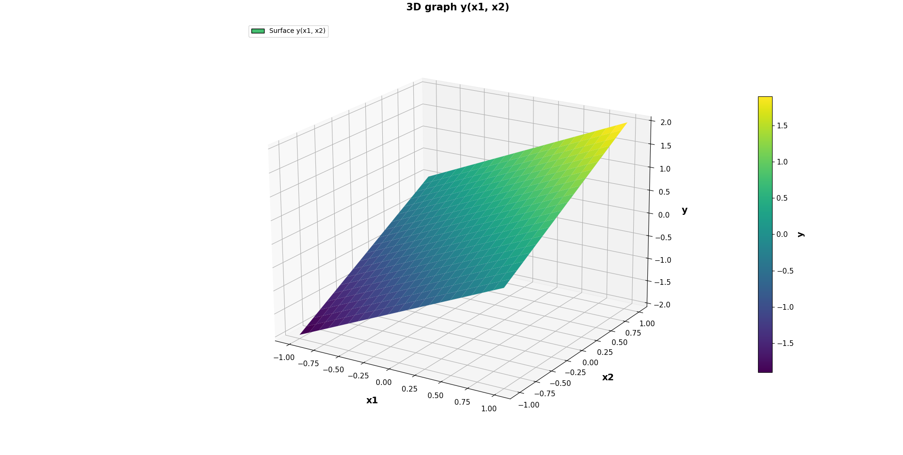
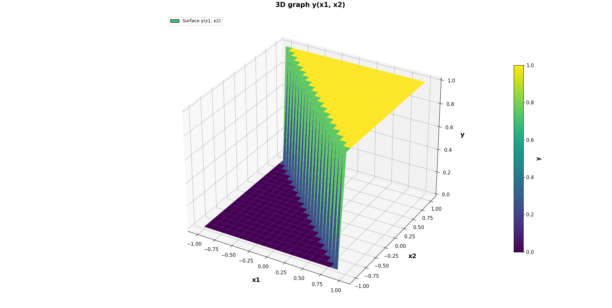
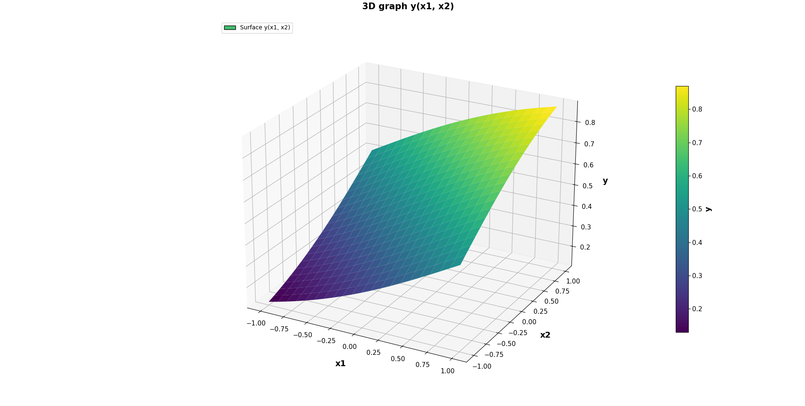
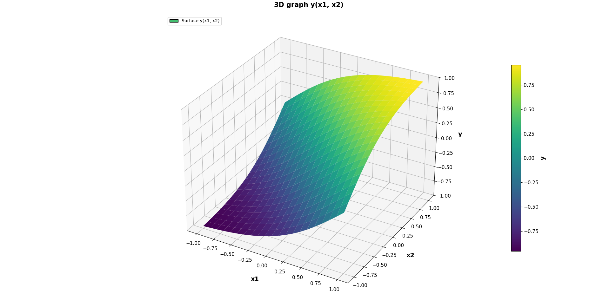

# Описание кода `neyron.cpp` и функций активации

## Что делает программа

Программа `neyron.cpp` моделирует простой нейрон с двумя входами.

Она делает 5 шагов:

1. читает коэффициенты `a0`, `a1`, `a2` из файла
2. читает входные данные `x1` и `x2`
3. считает внутреннее значение нейрона `v`
4. применяет выбранную функцию активации
5. записывает результат `y` в выходной файл

Основная формула нейрона:

```cpp
v = a0 + a1 * x1 + a2 * x2;
```

Где:

- `a0` это смещение
- `a1` это вес для `x1`
- `a2` это вес для `x2`

---

## Какие библиотеки подключены

```cpp
#include <iostream>
#include <fstream>
#include <cmath>
#include <string>
#include <cstdlib>
```

Назначение:

- `iostream` нужен для `cout` и `cerr`
- `fstream` нужен для работы с файлами
- `cmath` нужен для `exp()` и `tanh()`
- `string` нужен для переменной `mode`
- `cstdlib` нужен для `atof()`

---

## Функции активации в коде

В программе есть 4 отдельные функции активации.

### 1. Линейная функция

Код:

```cpp
float linear_activation(float v, float k, float b)
{
    return k * v + b;
}
```

Объяснение:

- `v` это уже посчитанное значение нейрона
- `k` это коэффициент наклона
- `b` это смещение
- функция возвращает обычное линейное значение без порога

То есть если `v` растет, то и выход тоже растет.

Место под картинку:



---

### 2. Пороговая функция

Код:

```cpp
float threshold_activation(float v)
{
    if (v < 0)
        return 0;

    return 1;
}
```

Объяснение:

- если `v` меньше нуля, функция возвращает `0`
- если `v` больше либо равно нулю, функция возвращает `1`

Это самый простой вариант бинарного решения.

Место под картинку:




---

### 3. Униполярная сигмоида

Код:

```cpp
float sigmoid_activation(float v, float alpha)
{
    return 1.0f / (1.0f + exp(-alpha * v));
}
```

Объяснение:

- `alpha` управляет крутизной кривой
- `exp(-alpha * v)` делает плавный переход
- результат всегда находится в диапазоне от `0` до `1`

Если `v` очень маленькое, выход близок к `0`.  
Если `v` очень большое, выход близок к `1`.

Место под картинку:





---

### 4. Биполярная сигмоида

Код:

```cpp
float bipolar_sigmoid_activation(float v, float alpha)
{
    return tanh(alpha * v);
}
```

Объяснение:

- используется функция `tanh()`
- `alpha` задает крутизну перехода
- результат лежит в диапазоне от `-1` до `1`

Если `v` отрицательное, ответ стремится к `-1`.  
Если `v` положительное, ответ стремится к `1`.

Место под картинку:




---

## Главная функция `main`

Точка входа:

```cpp
int main(int argn, char* argv[])
```

Здесь:

- `argn` это число аргументов командной строки
- `argv` это массив аргументов

---

## Какие переменные используются

```cpp
float x1, x2, y, a0, a1, a2, v;
float alpha = 1.0f;
float linear_k = 1.0f;
float linear_b = 0.0f;
int j;
int num_inputs = 2;
string mode = "2";
```

Назначение:

- `x1`, `x2` это входы нейрона
- `y` это итоговый выход
- `a0`, `a1`, `a2` это коэффициенты
- `v` это внутренняя сумма до активации
- `alpha` нужен для сигмоиды и `tanh`
- `linear_k` и `linear_b` нужны для линейной функции
- `j` это счетчик цикла
- `num_inputs = 2` означает два входа
- `mode` хранит выбранный тип активации

---

## Проверка аргументов запуска

Код:

```cpp
if (argn < 4 || argn > 8)
    cerr << argv[0] << " in.txt coef.txt out.txt [activation] [alpha] [linear_k] [linear_b]" << endl, exit(1);
```

Программа ожидает минимум 3 основных аргумента:

```bash
./neyron in.txt coef.txt out.txt
```

Дополнительно можно передать:

- тип активации
- `alpha`
- `linear_k`
- `linear_b`

---

## Выбор режима работы

Код:

```cpp
if (argn >= 5)
    mode = argv[4];

if (argn >= 6)
    alpha = atof(argv[5]);

if (argn >= 7)
    linear_k = atof(argv[6]);

if (argn >= 8)
    linear_b = atof(argv[7]);
```

Объяснение:

- если передан 5-й аргумент, выбирается функция активации
- если передан 6-й аргумент, он записывается в `alpha`
- если передан 7-й аргумент, он записывается в `linear_k`
- если передан 8-й аргумент, он записывается в `linear_b`

`atof()` переводит текст из аргумента командной строки в число типа `float`.

---

## Чтение коэффициентов из файла

Код:

```cpp
ifstream in(argv[2]);
in >> a0 >> a1 >> a2;
in.close();
```

Здесь программа открывает файл коэффициентов и читает три числа:

- `a0`
- `a1`
- `a2`

Потом файл закрывается.

---

## Открытие входного файла и проверка

Код:

```cpp
in.open(argv[1]);
if (!in)
    cerr << "No read input file \"" << argv[1] << "\"" << endl, exit(2);
```

Если входной файл не открылся, программа завершается с ошибкой.

---

## Подсчет количества входных чисел

Код:

```cpp
for (j = 0;;)
    if (in >> y) j++;
    else break;
```

Этот цикл считает, сколько чисел лежит во входном файле.

Так как у нейрона 2 входа, дальше количество строк определяется так:

```cpp
int N = j / num_inputs;
```

То есть общее число значений делится на 2.

---

## Основной цикл обработки данных

Код:

```cpp
in.open(argv[1]);
for (j = 0; j < N; j++)
{
    in >> x1 >> x2;
    v = a0 + a1 * x1 + a2 * x2;

    ...

    out << x1 << '\t' << x2 << '\t' << y << endl;
}
```

Что здесь происходит:

1. снова открывается входной файл
2. читается очередная пара `x1` и `x2`
3. считается внутреннее значение `v`
4. выбирается функция активации
5. результат `y` записывается в выходной файл

---

## Как выбирается функция активации

Код:

```cpp
if (mode == "1" || mode == "linear")
    y = linear_activation(v, linear_k, linear_b);
else if (mode == "2" || mode == "step" || mode == "threshold")
    y = threshold_activation(v);
else if (mode == "3" || mode == "sigmoid")
    y = sigmoid_activation(v, alpha);
else if (mode == "4" || mode == "tanh" || mode == "bipolar")
    y = bipolar_sigmoid_activation(v, alpha);
else
    cerr << "Unknown activation: " << mode << endl, exit(3);
```

Объяснение:

- если выбран `1` или `linear`, вызывается линейная функция
- если выбран `2`, `step` или `threshold`, вызывается пороговая функция
- если выбран `3` или `sigmoid`, вызывается сигмоида
- если выбран `4`, `tanh` или `bipolar`, вызывается биполярная сигмоида

Если передан неизвестный режим, программа завершится с ошибкой.

---

## Как записывается результат

Код:

```cpp
out << x1 << '\t' << x2 << '\t' << y << endl;
```

В файл записываются:

- первое входное значение
- второе входное значение
- результат работы нейрона

Каждая строка получается в формате:

```text
x1    x2    y
```

---

## Примеры запуска

Пороговая функция:

```bash
./neyron in.txt coef.txt out.txt
```

Линейная функция:

```bash
./neyron in.txt coef.txt out.txt linear 1 1 0
```

Сигмоида:

```bash
./neyron in.txt coef.txt out.txt sigmoid 1
```

Биполярная сигмоида:

```bash
./neyron in.txt coef.txt out.txt tanh 1
```

---

## Короткий вывод

`neyron.cpp` читает входные данные, считает значение нейрона и пропускает его через одну из 4 функций активации.  
Главная часть программы не меняется, меняется только способ получения итогового `y` из значения `v`.

---

# Описание кода `generator.cpp`

## Что делает программа

`generator.cpp` создает входные данные для нейрона.

Программа строит сетку значений для двух входов:

- `x1`
- `x2`

Значения идут в диапазоне от `-1` до `1` с шагом `0.1`.

Потом все пары значений записываются в файл.  
Именно этот файл потом можно передать в `neyron.cpp`.

---

## Подключение библиотек

```cpp
#include <iostream>
#include <fstream>
#include <cmath>
```

Здесь:

- `iostream` нужен для вывода в консоль
- `fstream` нужен для записи файла
- `cmath` нужен для `log10()` и `fabs()`

---

## Главная функция

Код:

```cpp
int main(int argn, char* argv[])
```

Программа запускается так:

```bash
./generator data.txt
```

Где `data.txt` это имя файла, в который будут записаны все сгенерированные пары входов.

---

## Основные переменные

Код:

```cpp
int i, j, k, t, N;
float delta = 0.1;
float L = 1;
int num_inputs = 2;
```

Объяснение:

- `delta` это шаг изменения входных значений
- `L` задает предел диапазона от `-L` до `L`
- `num_inputs = 2` означает, что будет два входа
- `N` это общее количество наборов данных
- `t` это точность вывода чисел
- `i`, `j`, `k` это счетчики циклов

---

## Проверка аргументов

Код:

```cpp
if (argn != 2)
    cerr << argv[0] << " sig.txt" << endl, exit(1);
```

Здесь программа проверяет, что ей передали имя выходного файла.

Если аргумент не передан, программа завершится с ошибкой.

---

## Вычисление числа шагов

Код:

```cpp
k = 1 + 2 * L / delta + 1e-6;
```

Объяснение:

- диапазон идет от `-1` до `1`
- общая длина диапазона равна `2 * L`
- при шаге `0.1` получается `21` точка

То есть значения будут такими:

```text
-1.0, -0.9, -0.8, ..., 0.8, 0.9, 1.0
```

---

## Вычисление точности вывода

Код:

```cpp
t = 1 + log10(1 / delta + 1e-6);
```

Эта строка нужна для того, чтобы числа записывались в файл с правильной точностью.

При `delta = 0.1` получается точность, достаточная для записи одного знака после запятой.

---

## Подсчет общего количества строк

Код:

```cpp
for (N = j = 1; j <= num_inputs; j++)
    N *= k;
```

Так как входов два, а для каждого входа есть `k` значений, число всех комбинаций равно:

```text
N = k * k
```

При `k = 21` получаем:

```text
N = 441
```

Это значит, что генератор создаст 441 строку.

---

## Проверка корректности `N`

Код:

```cpp
if (N < 1)
    cerr << "Error: N<1!" << endl, exit(1);
```

Если по какой-то причине количество строк получилось меньше 1, программа завершится с ошибкой.

---

## Создание массива входов

Код:

```cpp
float* X = new float[num_inputs];
```

Здесь создается динамический массив для хранения текущих значений входов.

Так как входов два, массив будет хранить:

- `X[0]` для первого входа
- `X[1]` для второго входа

---

## Начальное заполнение массива

Код:

```cpp
for (i = 0; i < num_inputs; i++)
    X[i] = -L;
```

В начале оба входа получают минимальное значение:

```text
-1
```

То есть генерация начинается с точки:

```text
(-1, -1)
```

---

## Открытие выходного файла

Код:

```cpp
ofstream out(argv[1]);

if (!out)
    cerr << "No create output file \"" << argv[1] << "\"" << endl, exit(2);
```

Здесь создается файл, в который будут записаны все пары входных значений.

Если файл не удалось создать, программа завершится с ошибкой.

---

## Установка точности записи

Код:

```cpp
out.precision(t);
```

Эта строка задает точность чисел при записи в файл.

---

## Основной цикл генерации

Код:

```cpp
for (j = 0; j < N; j++)
{
    for (i = 0; i < num_inputs; out << X[i++] << '\t');

    out << endl;

    for (k = 0; k < num_inputs; k++)
        if (X[k] > L - 1e-6)
            X[k] = -L;
        else
        {
            X[k] += delta;
            break;
        }

    if (fabs(X[k]) < 1e-6)
        X[k] = 0;
}
```

Что делает этот блок:

1. записывает текущие значения `X[0]` и `X[1]` в файл
2. переходит на новую строку
3. увеличивает очередной вход на `delta`
4. если значение дошло до верхней границы, оно сбрасывается обратно в `-L`
5. затем увеличивается следующий вход

По смыслу это похоже на работу счетчика:

- сначала меняется первый вход
- когда он доходит до конца, он сбрасывается
- после этого меняется второй вход

Так программа перебирает все возможные пары значений.

---

## Почему используется `fabs(X[k])`

Код:

```cpp
if (fabs(X[k]) < 1e-6)
    X[k] = 0;
```

Из-за работы с числами типа `float` вместо точного нуля иногда может получиться очень маленькое число, например:

```text
0.0000001
```

Эта проверка заменяет такие значения на точный `0`, чтобы файл выглядел аккуратнее.

---

## Завершение работы

Код:

```cpp
out.close();
delete[] X;

return 0;
```

Что происходит:

- файл закрывается
- выделенная память освобождается
- программа завершается без ошибки

---

## Что лежит в выходном файле

После работы `generator.cpp` файл содержит строки вида:

```text
-1.0   -1.0
-0.9   -1.0
-0.8   -1.0
...
1.0    1.0
```

То есть каждая строка это одна пара входных значений для нейрона.

---

## Как связаны `generator.cpp` и `neyron.cpp`

Работа обычно идет так:

1. `generator.cpp` создает файл входных данных
2. `neyron.cpp` читает этот файл
3. `neyron.cpp` считает выход `y` для каждой пары `x1`, `x2`
4. результат можно отправить в `3d_grafic.py` для построения графика

---

## Пример запуска

Сначала генератор:

```bash
./generator data.txt
```

Потом нейрон:

```bash
./neyron data.txt coef.txt out.txt sigmoid 1
```

После этого можно строить график по файлу `out.txt`.
