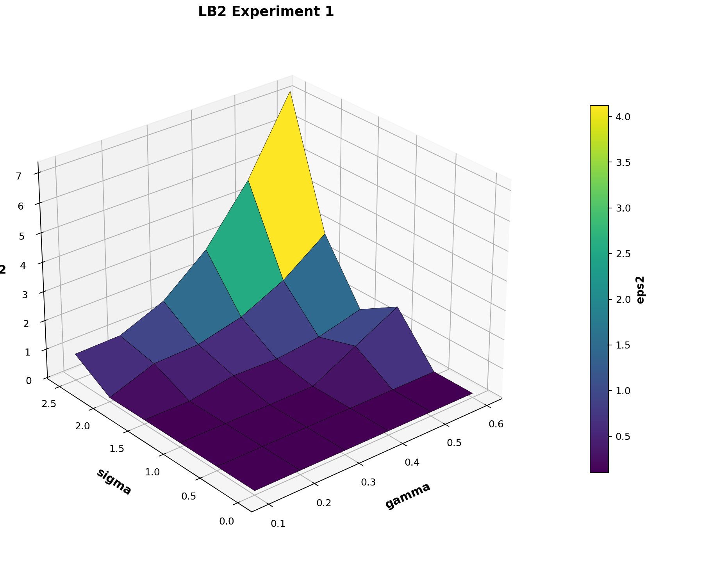
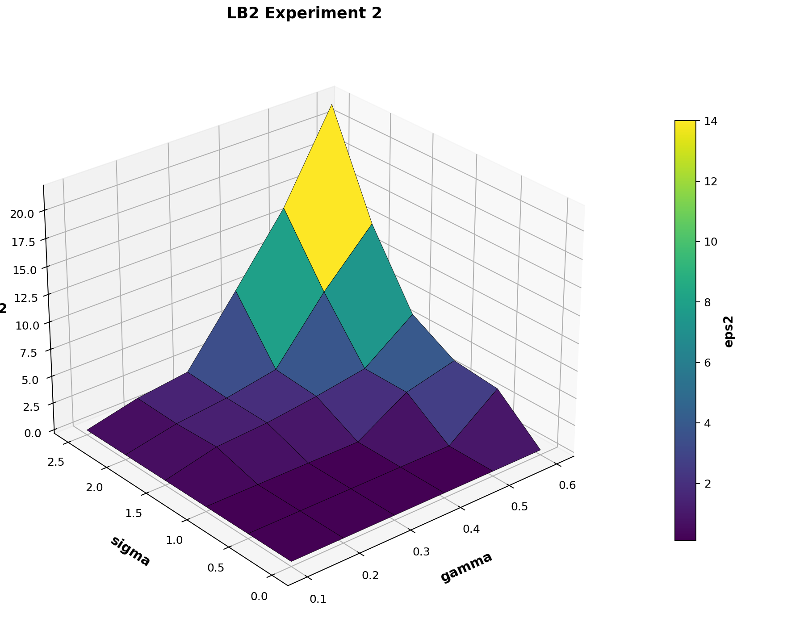
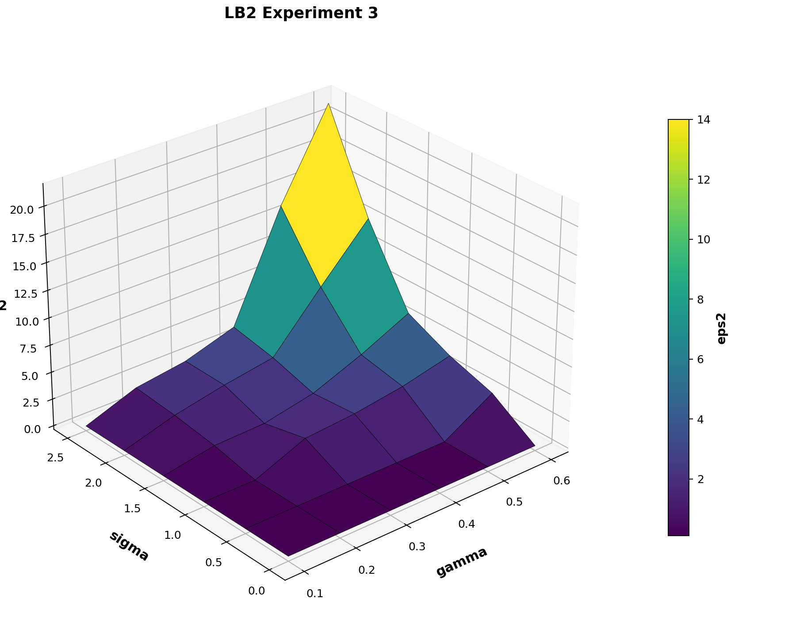

# Отчет по лабораторной работе №2

## Условия экспериментов

- Число шагов обучения: `1000`
- Порог успешного обучения: `eps2 < 0.1`
- В таблицах:
  - если обучение успешное, в ячейке записан номер шага
  - если обучение неуспешное, в ячейке записано `eps2 / шаг / вариант`
- Для графиков:
  - если обучение успешное, по методичке использовано значение `0.1`
  - если обучение неуспешное, использовано значение ошибки из отчета

## Эксперимент 1

- Файл коэффициентов: `coef_exp1.txt`
- Коэффициенты: `0.563, -0.708, 0.329, 0.367, -0.201, 0.945`
- Успешных запусков: `19` из `36`

| sigma / gamma | 0.1 | 0.2 | 0.3 | 0.4 | 0.5 | 0.6 |
|---|---|---|---|---|---|---|
| 0.0 | 61 | 18 | 17 | 54 | 116 | 621 |
| 0.5 | 52 | 15 | 15 | 57 | 238 | 63 |
| 1.0 | 40 | 69 | 124 | 228 | 0.885 / 5 / В | 1.662 / 5 / В |
| 1.5 | 54 | 206 | 0.353 / 5 / В | 0.311 / 5 / В | 0.471 / 5 / В | 0.853 / 5 / В |
| 2.0 | 29 | 0.656 / 5 / В | 0.703 / 5 / В | 1.066 / 5 / В | 1.780 / 5 / В | 2.860 / 5 / В |
| 2.5 | 0.870 / 4 / В | 0.902 / 5 / В | 1.521 / 5 / В | 2.760 / 5 / В | 4.649 / 5 / В | 7.206 / 5 / В |

## Эксперимент 2

- Файл коэффициентов: `coef_exp2.txt`
- Коэффициенты: `1.160, -0.803, 0.783, -0.400, 0.267, 0.136`
- Успешных запусков: `18` из `36`

| sigma / gamma | 0.1 | 0.2 | 0.3 | 0.4 | 0.5 | 0.6 |
|---|---|---|---|---|---|---|
| 0.0 | 106 | 40 | 30 | 59 | 139 | 254 |
| 0.5 | 103 | 26 | 29 | 103 | 293 | 3.538 / 4 / В |
| 1.0 | 97 | 42 | 126 | 434 | 2.844 / 1 / В | 3.951 / 4 / В |
| 1.5 | 40 | 1.223 / 4 / В | 1.516 / 4 / В | 2.098 / 1 / В | 2.845 / 1 / В | 6.164 / 4 / В |
| 2.0 | 166 | 1.062 / 5 / В | 1.579 / 1 / В | 2.407 / 1 / В | 7.928 / 5 / В | 12.609 / 5 / В |
| 2.5 | 64 | 1.195 / 1 / В | 1.809 / 1 / В | 7.711 / 5 / В | 13.758 / 5 / В | 21.741 / 5 / В |

## Эксперимент 3

- Файл коэффициентов: `coef_exp3.txt`
- Коэффициенты: `1.139, -0.555, 0.831, -0.853, 0.934, 0.251`
- Успешных запусков: `16` из `36`

| sigma / gamma | 0.1 | 0.2 | 0.3 | 0.4 | 0.5 | 0.6 |
|---|---|---|---|---|---|---|
| 0.0 | 155 | 61 | 52 | 54 | 147 | 273 |
| 0.5 | 165 | 77 | 50 | 52 | 103 | 2.750 / 3 / В |
| 1.0 | 180 | 32 | 1.992 / 5 / В | 2.350 / 4 / В | 3.019 / 4 / В | 4.055 / 4 / В |
| 1.5 | 139 | 0.941 / 5 / В | 1.082 / 5 / В | 2.013 / 5 / В | 3.808 / 1 / В | 5.930 / 5 / В |
| 2.0 | 158 | 1.480 / 5 / В | 2.432 / 1 / В | 3.176 / 1 / В | 8.067 / 5 / В | 12.778 / 4 / В |
| 2.5 | 172 | 1.819 / 5 / В | 2.495 / 1 / В | 3.932 / 1 / В | 13.643 / 4 / В | 21.535 / 4 / В |

